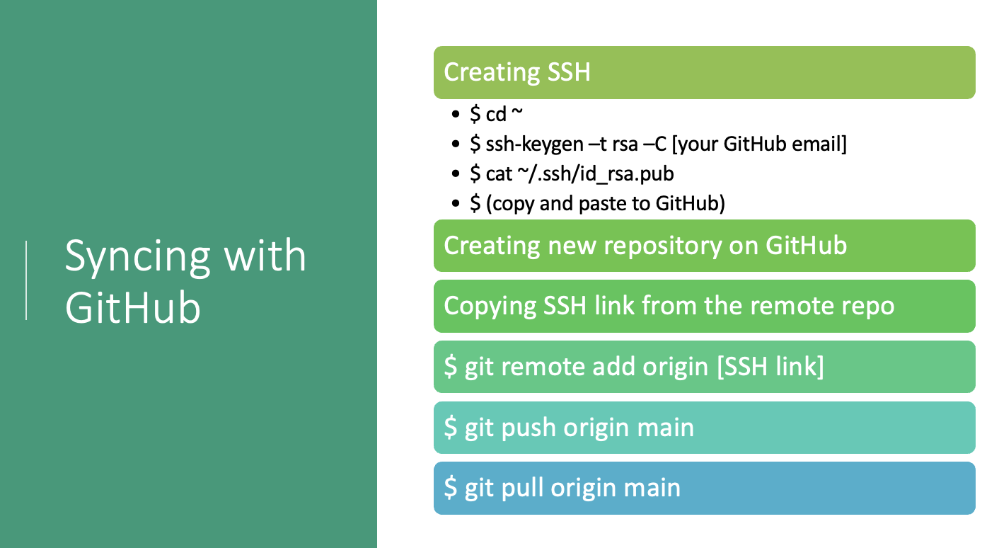

# Syncing with GitHub
{: .no_toc}

So far you used Git to create a repository called **hello-world** on your own computer, but no one else can see those files.  Next, you will use GitHub to share the contents of your repository so others can collaborate. This involves creating an empty repository in GitHub, then linking it to your local repository.

  

    Table of contents
  

  {: .text-delta }
 - TOC
{:toc}

## Create an empty GitHub repository

Log into your GitHub account and create a new repository by clicking the **+** icon in the upper-right corner of any page, then selecting **New repository**.  

- Name the repository "hello-world"
- Add optional description
- Ensure repository is set to "Public"
- Click "Create repository"

Though not mandatory, choosing a license is an important part of openly sharing your creative work online. For help selecting an appropriate license see [https://choosealicense.com/](https://choosealicense.com/).

After creating the "hello-world" repository, GitHub will display the repository main web-page on your browser.  This page contains information required to link your GitHub repository, `remote`, to the repository you created with Git on your own computer.
  
## Linking your local repository to the GitHub repository (using SSH or HTTPS)
  
We need to set up a way for our local computer to authenticate with GitHub so that GitHub recognizes our computer as belonging to the same person who owns the GitHub repository. 

GitHub removed password authentication on August 13, 2021. You have two options to connect your local machine to GitHub.

### Option 1. Connecting with SSH
  

First, copy the URL from your GitHub repository.
Move back to your shell application and enter the first command:

~~~
$ git remote add origin [git@github.com:yourname/hello-world.git] 
~~~

#### SSH Background and Setup
{: .no_toc}
  
  
SSH is a security protocol widely used by many applications. You can use the following commands to connect your newly created repository or your existing repository to Github. 

We will use SSH as our authentication method. SSH stands for Secure SHell protocol.  SSH is a cryptographic network protocol that allows secure communication between computers using an otherwise insecure network.

What we will do now is the minimum required to set up the SSH keys and add the public key to a GitHub account.

<!-- > ## Advanced SSH -->
<!-- > A supplemental episode in this lesson discusses SSH and key pairs in more depth and detail.-->
<!-- {: .callout}-->

The first thing we are going to do is check if this has already been done on the computer you’re on.  

> **Keeping your keys secure**  
> You shouldn't really forget about your SSH keys, since they keep your account secure. It’s good
>  practice to audit your secure shell keys every so often. Especially if you are using multiple
>  computers to access your account.
  
We will run the list command (`ls`) to check what key pairs already exist on your computer. 
In our command we use the `~` as the shorthand for "my home directory."

~~~
ls -al ~/.ssh
~~~
{: .language-bash}

If you have not set up SSH, your output might look like this:

~~~
ls: cannot access '/c/Users/YourName/.ssh': No such file or directory
~~~
{: .output}
  
If SSH has been set up on the computer you're using, the public and private key pairs will be listed. The file names are either `id_ed25519`/`id_ed25519.pub` or `id_rsa`/`id_rsa.pub` depending on how the key pairs were set up.

If you do not have SSH set up, let's set it up now. Use this command to create key pairs:

~~~
$ ssh-keygen -t rsa -C "yourname@domain.name"
~~~
{: .language-bash}

~~~
Generating public/private ed25519 key pair.
Enter file in which to save the key (/c/Users/YourName/.ssh/id_ed25519):
~~~
{: .output}

We want to use the default file, so just press <kbd>Enter</kbd>.

~~~
Created directory '/c/Users/YourName/.ssh'.
Enter passphrase (empty for no passphrase):
~~~
{: .output}

Your computer is now asking you for a passphrase to protect this SSH key pair. We recommend that you use a passphrase and that you make a note of it. There is no "reset my password" option for this setup. If you forget your passphrase, you have to delete your existing key pair and do this setup again. It's not a big deal, but easier if you don't have to repeat it. 

~~~
Enter same passphrase again:
~~~
{: .output}

After entering the same passphrase a second time, you will receive the confirmation

~~~
Your identification has been saved in /c/Users/YourName/.ssh/id_ed25519
Your public key has been saved in /c/Users/YourName/.ssh/id_ed25519.pub
The key fingerprint is:
SHA256:SMSPIStNyA00KPxuYu94KpZgRAYjgt9g4BA4kFy3g1o yourname@domain.name
The key's randomart image is:
+--[ED25519 256]--+
|^B== o.          |
|%*=.*.+          |
|+=.E =.+         |
| .=.+.o..        |
|....  . S        |
|.+ o             |
|+ =              |
|.o.o             |
|oo+.             |
+----[SHA256]-----+
~~~
{: .output}

The "identification" is actually the private key. You should never share it.  The public key is appropriately named.  The "key fingerprint"
is a shorter version of a public key.

Now we need to give our public key over to GitHub.

First, we need to copy the public key.  Be sure to include the `.pub` at the end, otherwise you’re looking at the private key.

~~~
cat ~/.ssh/id_rsa.pub
~~~
{: .language-bash}

~~~
ssh-ed25519 AAAAC3NzaC1lZDI1NTE5AAAAIDmRA3d51X0uu9wXek559gfn6UFNF69yZjChyBIU2qKI yourname@domain.name
~~~
{: .output}

Copy that entire line of output, and we will paste the copied text into GitHub in the next step.

Now, going to GitHub.com, click on your profile icon in the top right corner to get the drop-down menu.  Click "Settings," then on the
settings page, click "SSH and GPG keys," on the left side "Account settings" menu.  Click the "New SSH key" button on the right side. Now,
you can add the title (A person might use the title "My 2021 work laptop," just a little description to remind themselves which computer this public key connect to). 
Paste your SSH key into the field, and click the "Add SSH key" to complete the setup.

Now that we’ve set that up, let’s check our authentication from the command line.
~~~
$ ssh -T git@github.com
~~~
{: .language-bash}

~~~
Hi YourName! You've successfully authenticated, but GitHub does not provide shell access.
~~~
{: .output}

### Option 2. Connecting with HTTPS & GitHub Access Tokens

You can also use **HTTPS** protocol to connect your local repository to GitHub. Take a look at the following figure and find the commands you need to use to sync your local repository with Github. We will explain these commands in the rest of this section.

Now we are going to use the HTTPS protocol and GitHub access tokens (or Git Credential Manager, depending on your OS). GitHub access tokens are simple to obtain, but should be used with caution and should not be shared. 

#### Step 1: link the repositories with **"git remote add"**
{: .no_toc}
Enter the command below, replacing <your_github_username> as appropriate.

Input
{: .label .label-green }
~~~
$ git remote add origin https://github.com/<your_github_username>/<github-repository-name>.git 
~~~
{: .language-bash }

This links your local Git repository to a _remote_ one. The link indicates the location of the remote repository, which is nicknamed _origin_ in this example.  The nickname can be anything but Git convention is to refer to the remote repository as **origin**.  

We can confirm that it is set up correctly with this command:

Input
{: .label .label-green }
~~~
$ git remote -v
~~~

Output
{: .label .label-yellow }
~~~
origin  https://github.com/<your_github_username>/<github-repository-name> (fetch)
origin  https://github.com/<your_github_username>/<github-repository-name> (push)
~~~

#### Step 2: synchronize the repositories with **"git push"**
{: .no_toc}

The `git push` command can "push" our local content and tracking information to the GitHub repository, synchronizing the content. If you run `git push` right now, Git asks for your GitHub username and password. Even if you enter the correct username and password, the command will not work since support for password authentication was removed in 2021. To fix this error, you can use GitHub Access Tokens or use code editors that support API authentication. In this workshop, we use access tokens:

#### Step 3: Configure Access Token on GitHub
{: .no_toc}

You can use token-based authentication in place of a password when performing Git operations. Github currently supports two types of personal access tokens: fine-grained personal access tokens and personal access tokens (classic). They recommend using fine-grained tokens whenever possible. 

In the first step, we will create a personal Access Token on GitHub. Follow these steps to create one for your GitHub account:

* Click on your **GitHub profile icon** on the top right corner and click on **Settings**
* Choose **Developer Settings** on the menu on the left
* Click **fine-grained access tokens** and **Generate new token** Add a specific note that will help you identify the scope of the access token
* **Choose the Expiration period** from the drop down menu and select the scopes you want to grant the corresponding access to the generated access token. Make sure to select the minimum required scopes. For this workshop, `public_repo` should be enough.
* Click on **Generate Token**

Now, a new page is opened in which you can see your personal access token and copy it.

Now, we need to run the following command to use this access token:

Input
{: .label .label-green }
~~~
$ git remote set-url origin https://<github-token>@github.com/<username>/<repository-name>.git
~~~

  
## Pushing the local repository
    
Now, we have successfully established a connection between the two repositories. To synchronize the content of the remote and local repositories, we will have to "push" our local changes to the GitHub repository.

Input
{: .label .label-green }
~~~
$ git push -u origin main
~~~

Output
{: .label .label-yellow }
~~~
Counting objects: 3, done.
Writing objects: 100% (3/3), 226 bytes | 0 bytes/s, done.
Total 3 (delta 0), reused 0 (delta 0)
~~~

The nickname of our remote repository is "origin" and the default local branch name is "main".
The `-u` flag tells git to remember these parameters, so that next time we can simply run `git push`
and Git will know what to do.

When we do a `git push` we will see Git "pushing" changes to the specified remote repository - in this case, on GitHub. Because our file is small this happens instantly, but it may take longer if you made many changes or are adding a very large repository.  The `git status` command will indicate the status after "pushing" is complete.  

Input
{: .label .label-green }
~~~
$ git status
~~~

Output
{: .label .label-yellow }
~~~
On branch main
Your branch is up-to-date with 'origin/main'.
nothing to commit, working tree clean
~~~

This output lets us know where we are working (the main branch). We can also see that we have no changes to commit, and you'll find a copy of the "index.md" file in your GitHub "hello-world" repository.

If you add a readme file or license file to your GitHub repository, the commit on GitHub is ahead of your latest commit on the local main branch and you need to pull the latest changes to sync the two repositories:

## Pulling changes
  
When working with others or on multiple computers we need a way to pull all the remote changes back into our local repository. We can see how this works by adding a file to our GitHub repository, then "pulling" that change back to our computer.

Near the bottom of the "hello-world" repository on GitHub, there is a button to "Add a README" file to your repository. Click the button, enter some text, then scroll to the bottom and click "Commit new file" (The default commit message will be "Create README.md", which is fine for our purposes).

It is good practice to add a README file briefly describing what the project is about. If the README is in the root directory GitHub will automatically display it like a cover page for your repository.
{: .info}

After adding a README on GitHub your local repository is out-of-sync with the remote repository.  Let's fix that by pulling the remote changes into the local repository with `git pull`.

Input
{: .label .label-green }
~~~
$ git pull
~~~

Output
{: .label .label-yellow }
~~~
remote: Counting objects: 3, done.
remote: Compressing objects: 100% (2/2), done.
remote: Total 3 (delta 0), reused 0 (delta 0), pack-reused 0
Unpacking objects: 100% (3/3), done.
From https://github.com/<your_github_username>/hello-world
   8e2eb99..0f5a7b0  main     -> origin/main
Updating 8e2eb99..0f5a7b0
Fast-forward
 README.md | 1 +
 1 file changed, 1 insertion(+)
 create mode 100644 README.md
~~~

The output shows that we have fast-forwarded our local repository to include the file README.md. We could confirm this by entering the `ls` command.

This section introduces some basic git commands but there are many others that may be useful in more complex and collaborative projects. For a more detailed introduction see the online Software Carpentry course [Version control with Git](https://swcarpentry.github.io/git-novice/).