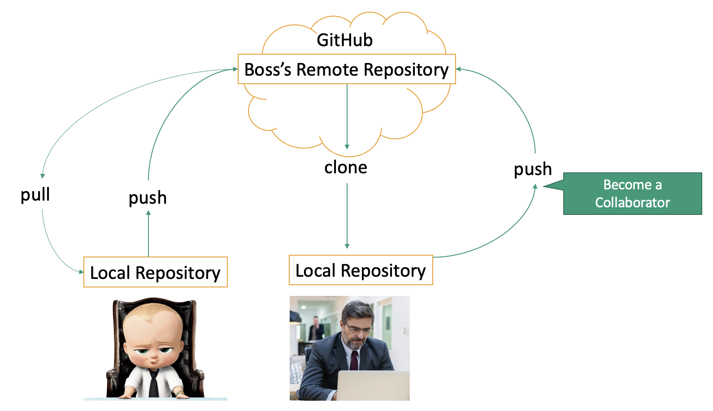
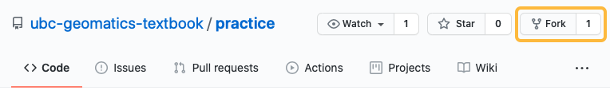
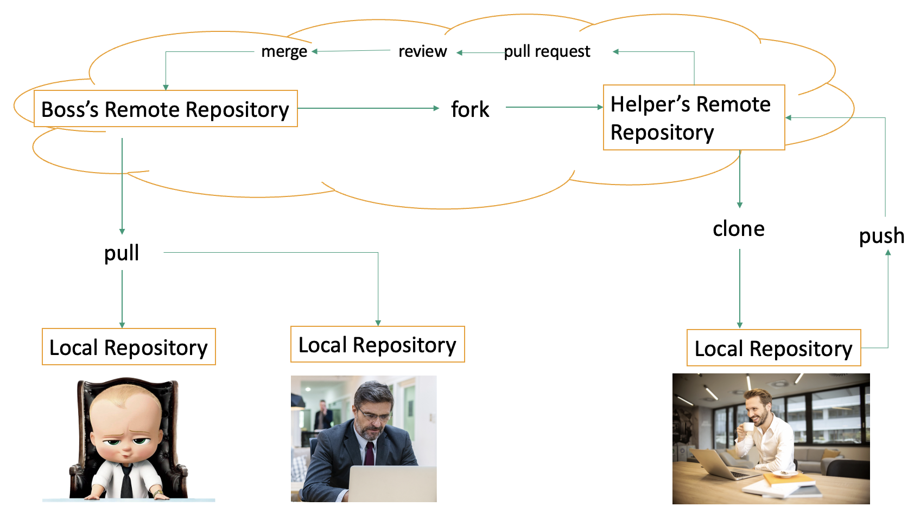
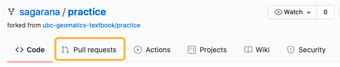
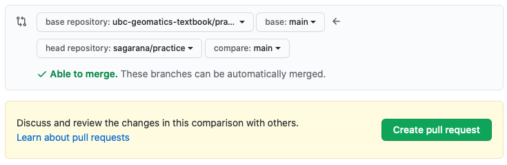
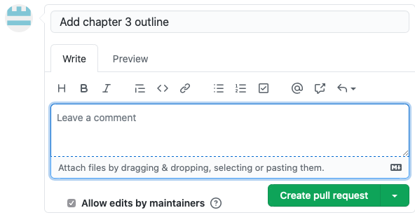
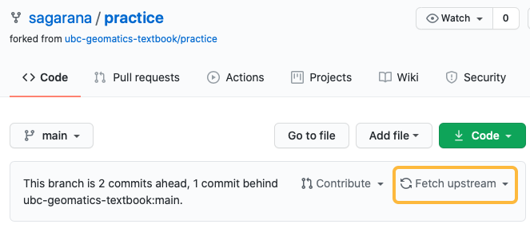

# Collaborating on GitHub

The GitHub platform facilitates collaboration by managing access and tracking activity on multi-author projects. A common workflow for teamwork is to use the _fork_, _clone_, and _pull request_ features of Git and GitHub. Consider this example: 

> _A team of 10 people is writing a textbook. Everyone will contribute content and the files will be stored in the main branch of the project repository. To avoid unintended conflicts each team member will work in their own copy of the repository, periodically merging their work back into the main project repository._ 

 

Here are some of the Git commands and GitHub features you will encounter in this workflow.

- **Fork**. A GitHub feature that makes a copy of another GitHub user's repository in your own GitHub account. You have full control over the fork because it's in your account. 
- **Clone**. A Git command that makes a local copy of a GitHub repository on your own computer. It allows you to write and edit using your preferred software, then commit and push your changes back to the repository on GitHub. (You can only push the changes back to GitHub if you have permission to edit the repository on GitHub.) 
- **Pull request**. A GitHub feature that allows the owner of the main project repository to "pull" in changes made in forks of the repository. When it's time to merge your own work with the main project repository, submit a "pull request" from your fork.

### Creating a fork
In this scenario team members never edit the main project repository: each person's work is done in a _fork_, a copy of the main repository that exists in their own GitHub account. 

To create a fork sign in to GitHub, navigate to the main project repository, then click the _Fork_ button in the top right corner. 



## Clone the fork to your own computer
GitHub is great for storing and sharing files but it's not a good platform for editing. The recommended practice is to _clone_ your repository, which creates a local copy on your own computer where you can edit the files with your preferred text editor. 

*1*{: .circle .circle-blue} In GitHub, find the repository to clone and click the _Code_ button. Copy the URL to use in the command below.  

*2*{: .circle .circle-blue} Open a terminal and navigate to the directory where you would like to copy the repository files.

*3*{: .circle .circle-blue} In the terminal use the command below to clone, replacing the URL with the one copied in step 1 above.

Input
{: .label .label-green}
```sh
$ git clone https://github.com/YOUR_GITHUB_USERNAME/REPOSITORY_NAME.git
```

Output
{: .label .label-yellow}
```sh
Cloning into 'practice'...
remote: Enumerating objects: 6, done.
remote: Counting objects: 100% (6/6), done.
remote: Compressing objects: 100% (4/4), done.
remote: Total 6 (delta 0), reused 0 (delta 0), pack-reused 0
Receiving objects: 100% (6/6), done.
```
Git will create a new directory named after the source repository. The directory is automatically tracked by git and it can be synchronized with its counterpart in your GitHub account. 

 

## Synchronizing forks and clones
As you edit the files on your local computer use the `git add` and `git commit` commands to take snapshots of your work. In a team environment it will be important to periodically synchronize the forks and clones so everyone's work is represented in the main project repository.


### Pushing local changes to your fork
It is good practice to regularly synchronize your local copy of the repository (the _clone_) with the repository in your own GitHub account (the _fork_).

To do this, open a terminal in your clone directory and run the command `git push`

Only local changes that have been _committed_ will be pushed back up to the fork on GitHub.
{: .note}


### Contributing to the main project directory
Once your work is in your _fork_ in GitHub you can contribute it to the main project repository by using a _Pull request_. This alerts the owner of the project repository and invites them to "pull" your contributions into the project repository, merging them with changes from other team members. 

*1*{: .circle .circle-blue} To create a _Pull request_ navigate to your fork in GitHub and click the _Pull requests_ link.



*2*{: .circle .circle-blue} In the next step click _Create pull request_



*3*{: .circle .circle-blue} You will be prompted to provide a title and optional comment that helps the team understand your contribution to the main project repository.



*4*{: .circle .circle-blue} The final step is to click _Create pull request_ to save your contribution. The project repository owner then has the opportunity to review your contributions before merging them into the main project.


### Keeping your fork current
A _fork_ is a copy of a directory at a moment in time. As other team members make contributions to the project repository your own fork may no longer reflect the current state of the project. When a fork is "behind" the project repository a note will appear in GitHub above the list of files. To incorporate changes from the main project into your local copy click the _Fetch upstream_ link.



### Keeping your local copy current
_Fetch upstream_ will update your _fork_ with other team members' changes. To bring those same changes back down to the _clone_ on your local machine use the `git pull` command.

*1*{: .circle .circle-blue} Open a terminal and navigate to the cloned repository in your local file system 

*2*{: .circle .circle-blue} Use the command `git pull` to incorporate content from the fork on GitHub 

### A Basic Collaborative Workflow

When collaborating it's important to work from an updated version of the repository so you should `git pull` before making
any changes. A basic workflow for collaboration might look like this:

* update your local repo with `git pull origin main`,
* make your changes and stage them with `git add`,
* commit your changes with `git commit -m`, and
* upload the changes to GitHub with `git push origin main`

Note: it is a good idea to make frequents commits to keep a history of changes in the git repository and prevent conflicts with other collaborators of the project


## Exercise

In this exercise, you are going to use Git and Github to fix mistakes in a repository. You can download the `sandbox` repository here: [address](address)

This repository supposed to have two folders. In the folder `text`, we would like to keep pieces of news as text files. In the second folder, `figures`, we would like to keep on figure for each file. The whole repository is a simplified version of a database for the news website.

There are some mistakes in the repository, such as files with wrong extensions, and some minor mistakes, such as mistakes in spelling of words. You are asked to add one more piece of news or fix the repository either directly on Github or by pulling the local repository, fixing the problems, and pushing it to the remote repository. 