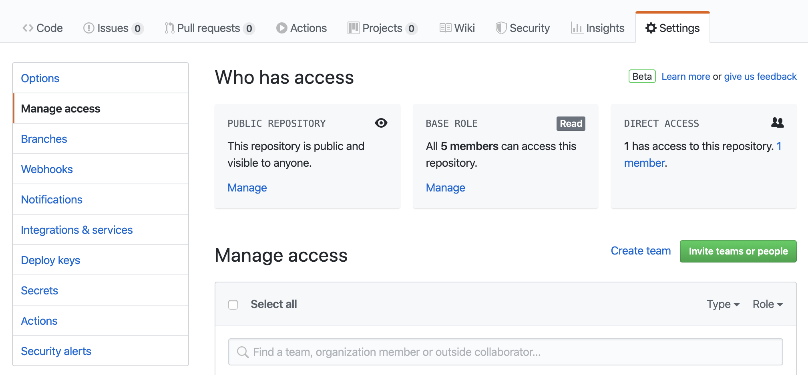

In this workshop, we only showed the basic features of Git. Git and GitHub have many more features. Here, we list a few of them:

### GitHub and Visual Studio Code

Visual Studio Code has integrated source control management and support Git. You can also install other source control providers through VS Code Extension Marketplace.

The source control icon on the Activity Bar indicates an overview of the changes in the current repository. You can also open it using Ctrl + Shift + G shortcut. If you do not have a repository, you should create one first. The Introduction to Git and GitHub workshop covers the basics of Git and how to sync your local repository with GitHub.

In VS Code, you can stage and commit changes using the graphical user interface or by the terminal.

## Graphical user interface for Git

Some terminal shells use some simple graphics to communicate a great deal of information about the current status of your git repository. 

**Zsh** is highly customizable and **Oh My Zsh** is a community-driven framework that provides lots of plugins and themes to enhance your command line experience. For example, you can view the state of your Git repository right inside the terminal. You can install Oh My Zsh [here](https://ohmyz.sh/#install).

*Zsh with agnoster theme*

#### Example: Source Control with VS Code

To use source control tools in VS Code, you need to install Git on your machine. You can download the latest version on Git Website. When VS Code detects a Source Control Management Provider, it will show the git repository automatically and any changes will be displayed in the Activity Bar.

To track a project, you only need to click on the git symbol in the Activity Bar and initialize a repository. When you add a .gitignore file to your repository, VS Code automatically updates the visual indicator for files that you want to be tracked and filters out the files that you want to ignore.

If you click on any files in the Source Control view, VS Code will show a diff, which compares the new file with the old file in your repository and flags the changes. You can stage and commit changes one by one or all at once using the buttons available in the Source Control view.

You can push the local repository to GitHub using the Push or Push to… commands in the Source Control view. If you cloned the repository before, Push command syncs the local changes. If you want to build a new repository and push changes, use Push to… command.

You can create and checkout branches directly within VS Code by selecting Git: Create Branch and Git: Checkout to commands in the Command Palette. After running Git: Checkout to, you will see a dropdown list containing all of the branches and tags in the current repository. You can also create a new branch in the dropdown list.

If you have a Source Control Management Provider in the workspace, Git Status Bar will be added to the Status Bar that shows the current checked-out branch. You can Publish the current branch to a remote or Synchronize Changes which will pull remote changes down to your local repository and then push local commits to the upstream branch. To learn more about the capabilities of Git Extension in VS Code, check out the Source Control in VS Code webpage.

### SSH Background and Setup
We need to set up a way for our local computer to authenticate with GitHub so that GitHub recognizes our computer as belonging to the same person who owns the GitHub repository. 

We will use SSH as our authentication method. SSH stands for Secure SHell protocol.  SSH is a cryptographic network protocol that allows secure communication between computers using an otherwise insecure network.

What we will do now is the minimum required to set up the SSH keys and add the public key to a GitHub account.

<!-- > ## Advanced SSH -->
<!-- > A supplemental episode in this lesson discusses SSH and key pairs in more depth and detail.-->
<!-- {: .callout}-->

The first thing we are going to do is check if this has already been done on the computer you’re on.  

> ### Keeping your keys secure
> You shouldn't really forget about your SSH keys, since they keep your account secure. It’s good
>  practice to audit your secure shell keys every so often. Especially if you are using multiple
>  computers to access your account.
{: .callout}

We will run the list command (`ls`) to check what key pairs already exist on your computer. 
In our command we use the `~` as the shorthand for "my home directory."

~~~
ls -al ~/.ssh
~~~
{: .language-bash}

If you have not set up SSH, your output might look like this:

~~~
ls: cannot access '/c/Users/YourName/.ssh': No such file or directory
~~~
{: .output}

If SSH has been set up on the computer you're using, the public and private key pairs will be listed. The file names are either `id_ed25519`/`id_ed25519.pub` or `id_rsa`/`id_rsa.pub` depending on how the key pairs were set up.

If you do not have SSH set up, let's set it up now. Use this command to create key pairs:

~~~
$ ssh-keygen -t rsa -C "yourname@domain.name"
~~~
{: .language-bash}

~~~
Generating public/private ed25519 key pair.
Enter file in which to save the key (/c/Users/YourName/.ssh/id_ed25519):
~~~
{: .output}

We want to use the default file, so just press <kbd>Enter</kbd>.

~~~
Created directory '/c/Users/YourName/.ssh'.
Enter passphrase (empty for no passphrase):
~~~
{: .output}

Your computer is now asking you for a passphrase to protect this SSH key pair. We recommend that you use a passphrase and that you make a note of it. There is no "reset my password" option for this setup. If you forget your passphrase, you have to delete your existing key pair and do this setup again. It's not a big deal, but easier if you don't have to repeat it. 

~~~
Enter same passphrase again:
~~~
{: .output}

After entering the same passphrase a second time, you will receive the confirmation

~~~
Your identification has been saved in /c/Users/YourName/.ssh/id_ed25519
Your public key has been saved in /c/Users/YourName/.ssh/id_ed25519.pub
The key fingerprint is:
SHA256:SMSPIStNyA00KPxuYu94KpZgRAYjgt9g4BA4kFy3g1o yourname@domain.name
The key's randomart image is:
+--[ED25519 256]--+
|^B== o.          |
|%*=.*.+          |
|+=.E =.+         |
| .=.+.o..        |
|....  . S        |
|.+ o             |
|+ =              |
|.o.o             |
|oo+.             |
+----[SHA256]-----+
~~~
{: .output}

The "identification" is actually the private key. You should never share it.  The public key is appropriately named.  The "key fingerprint"
is a shorter version of a public key.

Now we need to give our public key over to GitHub.

First, we need to copy the public key.  Be sure to include the `.pub` at the end, otherwise you’re looking at the private key.

~~~
cat ~/.ssh/id_rsa.pub
~~~
{: .language-bash}

~~~
ssh-ed25519 AAAAC3NzaC1lZDI1NTE5AAAAIDmRA3d51X0uu9wXek559gfn6UFNF69yZjChyBIU2qKI yourname@domain.name
~~~
{: .output}

Copy that entire line of output, and we will paste the copied text into GitHub in the next step.

Now, going to GitHub.com, click on your profile icon in the top right corner to get the drop-down menu.  Click "Settings," then on the
settings page, click "SSH and GPG keys," on the left side "Account settings" menu.  Click the "New SSH key" button on the right side. Now,
you can add the title (A person might use the title "My 2021 work laptop," just a little description to remind themselves which computer this public key connect to). 
Paste your SSH key into the field, and click the "Add SSH key" to complete the setup.

Now that we’ve set that up, let’s check our authentication from the command line.
~~~
$ ssh -T git@github.com
~~~
{: .language-bash}

~~~
Hi YourName! You've successfully authenticated, but GitHub does not provide shell access.
~~~
{: .output}

## Another Exercise: 

## Collaborating on GitHub

For the next step, get into pairs.  One person will be the "Owner" and the other
will be the "Collaborator". The goal is for the Collaborator to add changes into
the Owner's repository. If there is time we will switch roles at the end so everyone can play Owner and Collaborator.

First the Owner needs to give the Collaborator access to their repository.
Navigate to your repository On GitHub, click the settings button on the right,
then select Manage access. Click the green <em>Invite a collaborator</em> button and enter your partner's GitHub username in the search bar.

To accept access to the Owner's repo the Collaborator
needs to go to [https://github.com/notifications](https://github.com/notifications).

Next, the Collaborator needs to download a copy of the Owner's repository to their computer. This is called "cloning" a repository. To clone the Owner's "hello-world" repository onto
their `Desktop` the Collaborator would enter this command:

Input
{: .label .label-green}
~~~
$ git clone https://github.com/owner's-github-username/hello-world.git ~/Desktop/owner-hello-world
~~~

This creates a local copy of the owner's hello-world repository in a folder named <em>owner-hello-world</em>.  The collaborator can now make changes in their clone of the Owner's repository using the commands introduced earlier.

- use `cd` to navigate to the cloned repository
- use `touch` to create a new file in the repository
- add a few lines to the file using a text editor
- use `git add` to stage the file
- use `git commit -m "Commit note"` to commit the changes

Then push the Collaborator's change(s) to the *Owner's* repository on GitHub:

Input
{: .label .label-green}
~~~
$ git push origin main
~~~

Note that this time we didn't have to create a remote called `origin`: Git uses this
name by default when we clone a repository.  (This is why `origin` was a
sensible choice for a nickname earlier when we were setting up remotes by hand.)

Take another look to the Owner's repository on the GitHub website (you might need
to refresh your browser). You should be able to see the new commit made by the
Collaborator.

To download the Collaborator's changes from GitHub, the Owner now enters this command on their own computer:

Input
{: .label .label-green}
~~~
$ git pull origin main
~~~

Now the three repositories - Owner's local, Collaborator's local, and Owner's on
GitHub - are back in sync.

___Switch Owner and Collaborator roles if time permits and you'd like more practice___